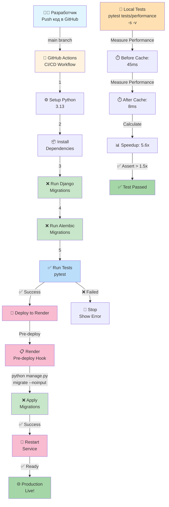

---

## 🔀 ПОТОК ДАННЫХ: МИГРАЦИИ И ТЕСТЫ

```
1️⃣  ЛОКАЛЬНАЯ РАЗРАБОТКА
    ├── python manage.py makemigrations      (создать миграцию)
    ├── python manage.py migrate              (применить локально)
    └── pytest tests/ -s                      (тестировать)

2️⃣  GIT PUSH → GitHub
    └── git push origin feature-branch

3️⃣  GITHUB ACTIONS (Automatic)
    ├── Checkout code
    ├── Setup Python 3.13
    ├── pip install requirements.txt
    ├── python manage.py migrate --noinput   ✅ МИГРАЦИИ
    ├── python -m alembic upgrade head       ✅ ALEMBIC
    └── pytest -v                             ✅ ТЕСТЫ

4️⃣  ЕСЛИ ВСЕ OK → RENDER DEPLOYMENT
    └── Pull latest code from main

5️⃣  RENDER (Automatic)
    ├── Build: pip install -r requirements.txt
    ├── Pre-deploy: python manage.py migrate --noinput   ✅ МИГРАЦИИ
    ├── Start: gunicorn core.wsgi:application
    └── Health check: /health

6️⃣  PRODUCTION READY ✅
    └── Приложение работает с актуальной БД
```

---

## 📊 ДИАГРАММА ПРОИЗВОДИТЕЛЬНОСТИ КЭША

```
╔════════════════════════════════════════════════════════════╗
║           ТЕСТ ПРОИЗВОДИТЕЛЬНОСТИ КЭША                     ║
╠════════════════════════════════════════════════════════════╣
║                                                              ║
║  1️⃣  cache.clear()   ← Очищаем весь кэш                   ║
║                                                              ║
║  2️⃣  Запрос без кэша (из БД)                              ║
║       ▓▓▓▓▓▓▓▓▓▓▓▓▓▓▓▓▓▓▓▓▓▓▓▓▓▓▓▓▓  45 ms               ║
║       SELECT * FROM table; (slow)                          ║
║                                                              ║
║  3️⃣  Запрос с кэшем (из Redis)                            ║
║       ▓▓▓▓▓  8 ms                                          ║
║       GET cache_key; (fast)                                ║
║                                                              ║
║  4️⃣  Расчет ускорения                                     ║
║       45 ms / 8 ms = 5.6x ← ✅ OK (> 1.5x)               ║
║                                                              ║
╚════════════════════════════════════════════════════════════╝
```

---

## 🏗️ АРХИТЕКТУРА ПРИЛОЖЕНИЯ

```
┌────────────────────────────────────────────────────────┐
│                    USER REQUEST                         │
└────────────────────────────────────────────────────────┘
                            │
                            ▼
┌────────────────────────────────────────────────────────┐
│              DJANGO REQUEST HANDLER                     │
│                   (views.py)                            │
└────────────────────────────────────────────────────────┘
                            │
                ┌───────────┴───────────┐
                ▼                       ▼
        ┌─────────────────┐    ┌──────────────────┐
        │  CHECK CACHE    │    │  CHECK DATABASE  │
        │   (Redis)       │    │   (PostgreSQL)   │
        └────────┬────────┘    └────────┬─────────┘
                 │                      │
        HIT? ✅  │    MISS? ❌           │
                 │                      │
                 ▼                      ▼
        ┌──────────────────┐  ┌─────────────────┐
        │ Return Cached    │  │ Query Database  │
        │ Response (8ms)   │  │ (45ms)          │
        └────────┬─────────┘  └────────┬────────┘
                 │                     │
                 │             ┌───────▼─────────┐
                 │             │  SAVE TO CACHE  │
                 │             │  (TTL: 5min)    │
                 │             └───────┬─────────┘
                 │                     │
                 └─────────┬───────────┘
                           ▼
        ┌─────────────────────────────────────┐
        │        SEND RESPONSE TO USER        │
        └─────────────────────────────────────┘
```

---

## 🎯 ВЕХИ РЕАЛИЗАЦИИ

```
ЭТАП 1: GitHub Actions (✅ ГОТОВО)
├── Обновлена конфигурация .github/workflows/deploy.yml
├── Добавлена команда миграций Django
├── Добавлена поддержка Alembic
└── Результат: Миграции при каждом push

ЭТАП 2: Render Pre-deploy (✅ ГОТОВО)
├── Создан скрипт render_predeploy.sh
├── Создана конфигурация render.yaml
└── Результат: Миграции перед перезапуском приложения

ЭТАП 3: Тесты Производительности (✅ ГОТОВО)
├── Создан файл test_cache_performance.py
├── 7 комплексных тестов
├── Проверка ускорения 1.5-10x
└── Результат: pytest tests/performance/ -s

ЭТАП 4: Утилиты и Документация (✅ ГОТОВО)
├── Утилита manage_cache.py
├── Полная документация (4 файла)
├── Примеры выводов
└── Результат: Полная готовность к продакшену

ЭТАП 5: PRODUCTION READY (✅)
└── Всё готово к запуску! 🚀
```

---

## 📝 КОНТРОЛЬНЫЙ ЛИСТ ВНЕДРЕНИЯ

```
☐ 1. Локально: Проверить Redis
     python manage_cache.py test-redis

☐ 2. Локально: Запустить тесты производительности
     pytest tests/performance/ -s

☐ 3. GitHub: Создать feature branch
     git checkout -b feature/migrations-setup

☐ 4. GitHub: Сделать коммит всех файлов
     git add .
     git commit -m "Add migrations and performance tests"

☐ 5. GitHub: Push и создать Pull Request
     git push origin feature/migrations-setup

☐ 6. GitHub: Проверить что GitHub Actions прошел успешно

☐ 7. Render: Добавить Pre-deploy команду
     Settings → Deploy → Pre-deploy command
     cd classes-main && python manage.py migrate --noinput

☐ 8. Render: Нажать Deploy и проверить логи
     Render Dashboard → Logs

☐ 9. GitHub: Merge в main (после успешного тестирования)

☐ 10. Render: Автоматический деплой на production
      Следить за логами (должно быть 2-3 минуты)

☐ 11. Production: Проверить что приложение работает
      Открыть https://your-app.onrender.com

☐ 12. Локально: Добавить тесты в CI/CD
      Убедитесь, что тесты в pytest.ini правильные
```

---

## 🔗 ИНТЕГРАЦИЯ С СУЩЕСТВУЮЩИМ КОДОМ

### Где добавить кэширование в views.py?

**Пример 1: Декоратор (быстро)**
```python
from django.views.decorators.cache import cache_page

@cache_page(60 * 5)  # 5 минут
def home(request):
    return render(request, 'home.html')
```

**Пример 2: В коде (гибко)**
```python
from django.core.cache import cache

def search(request):
    query = request.GET.get('q', '')
    cache_key = f'search_{query}'
    
    results = cache.get(cache_key)
    if results is None:
        results = Job.objects.filter(title__icontains=query)
        cache.set(cache_key, list(results), 600)
    
    return render(request, 'search.html', {'results': results})
```

**Пример 3: Класс (объектно-ориентированно)**
```python
from django.views import View
from django.core.cache import cache

class HomeView(View):
    cache_timeout = 60 * 5
    cache_key = 'home_page'
    
    def get(self, request):
        html = cache.get(self.cache_key)
        
        if html is None:
            html = render_to_string('home.html')
            cache.set(self.cache_key, html, self.cache_timeout)
        
        return HttpResponse(html)
```

---

## 🚨 ОТЛАДКА ПРОБЛЕМ

| Проблема | Признак | Решение |
|----------|---------|---------|
| Redis не работает | `test-redis` падает | `docker ps \| grep redis` или `redis-server` |
| Тест падает (ускорение < 1.5x) | AssertionError | Проверить что в view есть `@cache_page` или `cache.set` |
| Миграции не применяются | `table does not exist` | `python manage.py migrate --list` |
| GitHub Actions падает | Build error в логах | Проверить зависимости в `requirements.txt` |
| Render deplot падает | Pre-deploy error в логах | Проверить синтаксис команды |

---

## 📚 ДОПОЛНИТЕЛЬНЫЕ РЕСУРСЫ

- 📖 [Django Cache Documentation](https://docs.djangoproject.com/en/4.2/topics/cache/)
- 📖 [Django Migrations](https://docs.djangoproject.com/en/4.2/topics/migrations/)
- 📖 [GitHub Actions](https://docs.github.com/en/actions)
- 📖 [Render Docs](https://render.com/docs)
- 📖 [Pytest Django](https://pytest-django.readthedocs.io/)
- 📖 [Redis Python](https://redis-py.readthedocs.io/)

---

## ✨ УСПЕХОВ С ВНЕДРЕНИЕМ! 🚀

Если у вас есть вопросы, смотрите:
1. `MIGRATION_AND_CACHE_GUIDE.md` — Полная инструкция
2. `QUICK_REFERENCE.md` — Краткий справочник
3. `TEST_OUTPUT_EXAMPLES.md` — Примеры вывода
4. `IMPLEMENTATION_SUMMARY.md` — Резюме и чеклист
